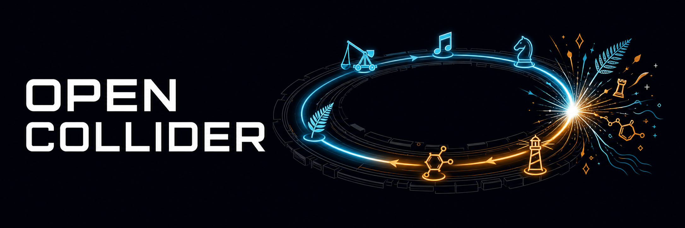

<p align="center">
  
</p>

# Open Collider

A single [pi](https://github.com/earendil-works/pi-coding-agent) extension that forces your ideation through collisions with **randomly drawn external sources**, using a **blind two-phase protocol** — so the ideas come from places neither you nor the model would point to on purpose.

Built for idea sessions: product directions, repo strategy, app concepts, research angles, or anything where direct prompting only produces the obvious.

## Credit

This package is based on the method and conceptual architecture of the original **Open Collider** project:

- Repository: <https://github.com/CL-ML/open-collider>
- Author: Cédric Lion / Oparine

Open Collider's core idea is that useful originality comes from forcing an LLM to reason through a counter-intuitive causal principle from a structurally distant domain before generating ideas.

## Why this works when prompting doesn't

Asking a model to "pick a structurally distant domain" fails quietly: the model answers in its modal way and reaches for the same handful of favorite metaphors every time. The two design moves here are things a prompt cannot do, only an extension can:

1. **External entropy.** The collision domain is not chosen by you or the model. The extension draws random articles from Wikipedia's random-page API — millions of substantive topics sampled uniformly. The model's job shifts from *selecting* a domain (where mode collapse lives) to *distilling and mapping* a mechanism (where it's actually good).
2. **Blindness.** The model elaborates each source's causal mechanism in Phase A **without seeing your question** — the extension withholds it until Phase B. This prevents back-fitting, where the model skims the source for whatever conveniently justifies the idea it already had.

## How a collision runs

```text
/collide how do we make onboarding feel less like a form?
```

1. **Draw** — the extension fetches 3 random Wikipedia articles (stubs filtered out, recently drawn topics excluded).
2. **Phase A (blind)** — the model extracts the counter-intuitive *active causal mechanism* from each source, staying entirely inside the source's own domain. It does not know your question yet.
3. **Phase B (collision)** — your question is delivered. The model restates it structurally, picks the mechanism with the strongest structural fit (or honestly recommends `/reroll` if nothing fits), writes the explicit mapping, and generates 2-4 collision-born ideas — each with a concrete next step and its strongest objection.
4. **Ablation check** — for every idea: delete the source mechanism — does the idea still stand? If yes, it's discarded as generic advice wearing a costume.
5. **Log** — the draw is appended to `.pi/open-collider/collisions.jsonl`, where you can rate it.

## Commands

| Command | What it does |
|---|---|
| `/collide <question>` | Standard collision: 3 random sources, blind two-phase |
| `/collide-deep <question>` | Two random sources are first intersected into a composite principle, then collided — weirder, noisier |
| `/reroll` | Redraw fresh sources for the most recent question |
| `/collision-rate <verdict>` | Rate the last collision (`fertile`, `dead`, or any short note) |
| `/collision-log` | Show the draw log in the transcript |

Run `/collide` with no arguments to be prompted for the question interactively.

## Installation

From the root of any pi project:

```bash
mkdir -p .pi/extensions
git clone https://github.com/eSaadster/pi-collider-immune-system /tmp/pi-collider-immune-system
cp -R /tmp/pi-collider-immune-system/open-collider .pi/extensions/
```

Then restart pi or run:

```text
/reload
```

Requires network access to `en.wikipedia.org` at collision time.

## Note on earlier versions

Earlier versions of this package shipped three layered extensions (`open-collider`, `collision-quarantine`, `collision-mycelium`) built around prompt injection and output auditing. They were consolidated into this single extension: orchestration makes compliance structural, so there is nothing left to police — and steering toward remembered favorite domains turned out to be the opposite of novelty. The draw log replaces the memory layer as a plain record.
